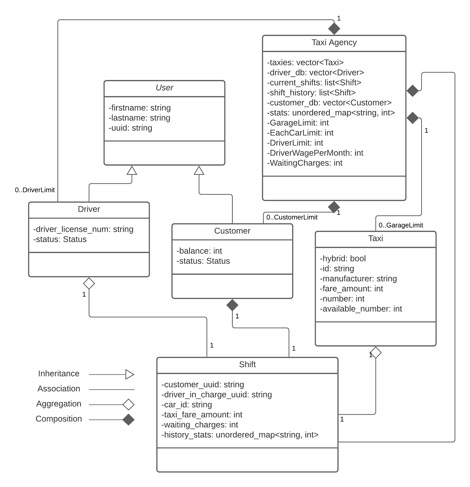

# Taxi Agency

 * [Introduction](#Introduction)
 * [Usage](#Introduction)
 * [About](#About)
   * [Class Design](#Class-Design)
   * [Testing](#Testing)
 * [Dependencies](#Dependencies)


## Introduction
The motive of the project is to create an Object-oriented Database Model for a Taxi Agency. Each type of object in the problem space has been mapped to a certain class in the Object Oriented Solution Space. It's sort of an API wrapper which allows a programmer to create, read, update and erase (CRUD) object data using the interface provided by Taxi Agency class during the execution of the program. In simple terms, this app essentially allows a backend programmer to mimick an UI programmatically, rather than having a concrete graphical or text based UI.

## Usage
Run the following commands in the app root directory.

```cpp
make // compile tests
./output // run tests
```

```cpp
make reset // compile reset file
./output // run reset
```

```cpp
make clean // clean
```


## About


[Read Docs](./docs) <br />
[Project Config](config.yaml)

## Class Design

Classes:
 * Taxi Agency
 * User
   * Customer
   * Driver
 * Taxi
 * Shift

Standard Template Library Classes used:
 * vector<T>
 * list<T>
 * unordered_map<T1, T2>


|Class|Description|
|-----|-----------|
|Taxi Agency|An instance of Taxi Agency class behaves like a container to the list of all the entities (Driver, Customer, Taxi, Shift (ongoing, history)). It stores basic stats like limits of the Agency (based on budget, which can be upgraded upon investment), employee vacancies, ongoing shifts, etc. It also maintains a record of the history of shifts.Destruction of a Taxi Agency instance leads to the destruction of all the containers contained in it, thus, all the instances of the User, Customer, Taxi and Shift classes.|
|User|All the users registered with the Taxi Agency. It uses `uuid` as its primary key. `Customer` class and `Driver` class inherits `User` class.|
|Taxi|Holds data about the Taxi. Each record can represents a breed of Taxi and an Agency can own more than one car of a certain breed.|
|Shift|Holds information about a certaing booking, which can be made by a customer.|

## Testing
The test relies on an initial static CSV data, which has been provided in the relative path `./data/sample`. However, the test only alters the CSV files present in `./data`. <br />
It is essential to reset the data back to the initial point in order for the tests to run successfully. <br />
`./config.hpp` contains the relative paths to all the CSV files.

## Dependencies
Dependencies for interactive console testings <br />
[agauniyal/rang](https://github.com/agauniyal/rang/blob/master/include/rang.hpp)

Sample Data Courtesy: [Taxi Data](https://corgis-edu.github.io/corgis/csv/cars/)
